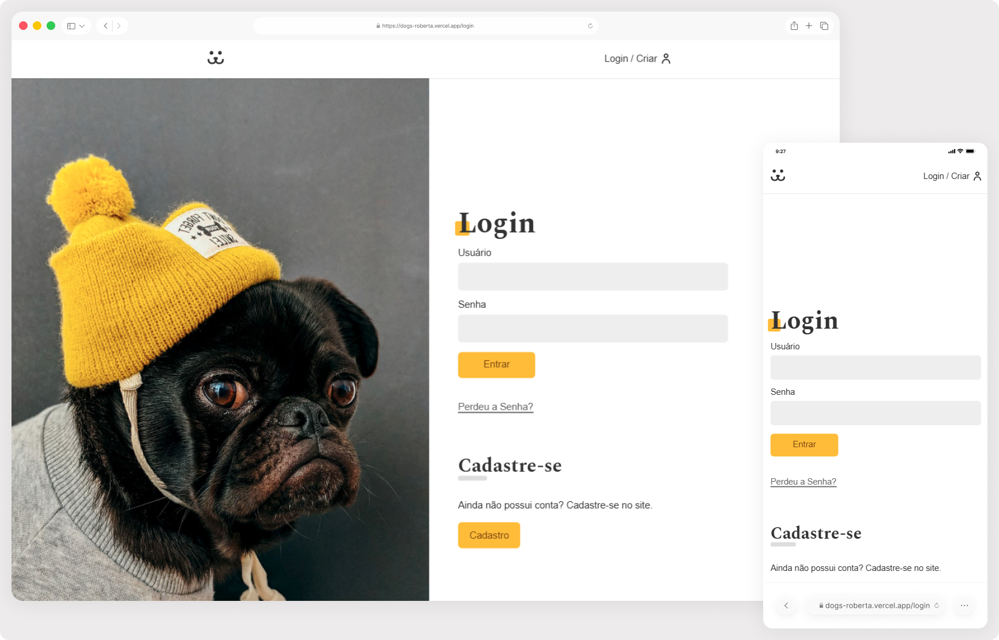

# Dogs 🐾

Rede social para amantes de cachorros, onde é possível criar uma conta, fazer login, postar fotos dos seus pets e interagir com as publicações de outros usuários. Projeto desenvolvido durante o curso de React da Origamid.

> Status do Projeto: Em desenvolvimento ⌛

## Acesse o projeto

🔗 [https://dogs-roberta.vercel.app/](https://dogs-roberta.vercel.app/)

## Funcionalidades

- Cadastro e autenticação de usuários
- Login e logout com persistência de sessão
- Upload de fotos com título e peso do pet
- Feed com fotos de todos os usuários
- Página de perfil com estatísticas e fotos do usuário
- Visualização de foto individual com número de acessos
- Proteção de rotas para usuários autenticados

## Objetivos técnicos

- Componentização e reutilização de componentes React
- Gerenciamento de estado global com Context API
- Consumo de API externa (Dogs API)
- Roteamento com React Router DOM
- Autenticação via token (JWT)
- Formulários controlados com validação personalizada
- Hooks customizados para lógica reutilizável
- Upload de arquivos via formulário

## Tecnologias

- React
- React Router DOM
- Context API
- JavaScript (ES6+)
- CSS Modules
- API REST externa (Dogs API)

## Preview 👀

